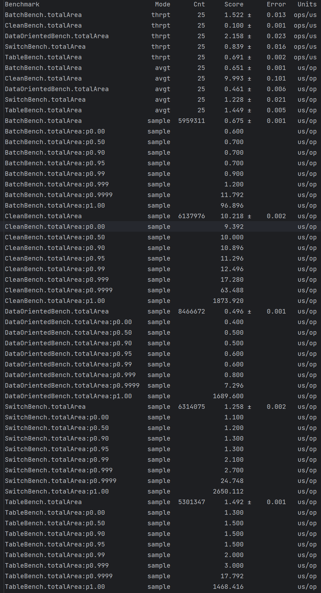

# CCHP
"Clean" Code Horrible Performance inspired benchmarks but in Kotlin

The test is not really apples to apples as I'm randomly generating shapes for each test, but the idea is to show how different approaches can affect performance.

## Setup
You are required to have JDK 21 installed;

## Build
`./gradlew clean build`

## Running benchmarks
`./gradlew clean jmh`

You can also run the main function for a quick benchmark:

```
Shape count = 5000000
Clean: 52 ms
Clean Pattern matching: 38 ms
Switch 46 ms
Table: 23 ms
Batch: 25 ms
DataOriented: 10 ms
DataOrientedSIMD: 2 ms
```
## Sample
Specs:
```
CPU: AMD Zen 4 R7 7800X3D
Memory: 32GB DDR5 6000Mhz
GPU: NVIDIA RTX 4090
Storage: 2TB NVME SSD Samsung 980 PRO
```

